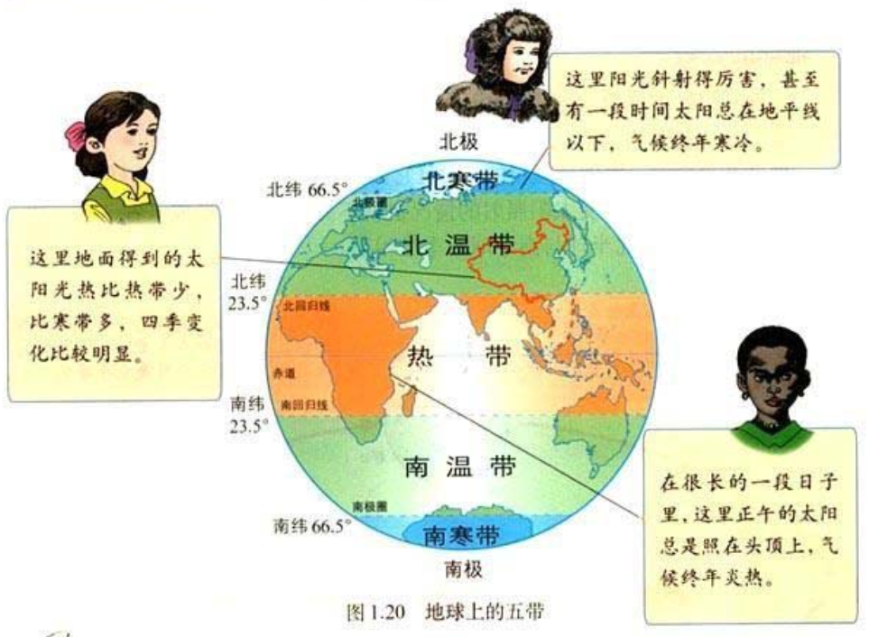

# 第一章 地球和地图
## 地球和地球仪
### 地球

### 经纬线

- 北半球
    - 非洲
    - 北美
    - 亚洲
    - 欧洲
- 南半球
    - 南美
    - 大洋洲
    - 南极洲
    - 一小部分非洲
- 东半球
    - 亚洲
    - 欧洲
    - 非洲
    - 大洋洲
    - 南极洲
- 西半球
    - 北美
    - 南美
    - 大洋洲

## 地球的运动
### 自传
- 从北极看自西向东
- 周期为24小时
- 导致昼夜变化

### 公转
- 自西向东
- 周期一年
- 导致四季变化

- 地球表面的5个带
    - 根据太阳热量在地表的分布状况

## 地图
### 等高线

# 第二章 陆地和海洋
## 大洲和大洋
- 海洋占地球面积71%， 大陆29%
- 南半球大陆面积10%，北半球48%
- 七大洲
    - 亚洲，非洲，欧洲， 大洋洲，南极洲
    - 北美洲，南美洲
- 四大洋
    - 太平洋>大西洋>印度洋>北冰洋

    

## 海陆的变迁
### 大陆漂移说

### 板块的运动
- 由岩石组成的地球表层并不是整体一块，而是由板块拼合而成
- 全球分为六大板块
- 板块交界的地带，地壳比较活跃。火山，地震带集中分布在板块交界地带
- 地壳板块发生张烈运动形成大裂谷
    - 亚洲非洲之间的红海在扩张，预言几千万年后，红海将成为新的大洋
- 发生碰撞挤压形成山脉
    - 欧洲非洲之间的地中海在缩小，预言几千万年后地中海将会消失

# 第三章 天气与气候

# 第四章 居民与聚落

# 第五章 发展与合作

# 第六章 亚洲
## 自然环境
### 位置

### 六个地区

### 地形

### 气候

## 人文环境

# 第七章 我们邻近的国家和地区
## 日本
### 多火山地震的岛国
- 4个大岛：北海道，本州，四国，九州
- 主要城市：东京，横滨，名古屋，大阪，神户，北九州，长崎

### 发达的加工贸易经济
## 东南亚
### 十字路口的位置
- 中南半岛
    - 缅甸
    - 泰国
    - 老挝
    - 越南
    - 柬埔寨
- 马来群岛
    - 马来西亚
    - 印度尼西亚
    - 菲律宾

### 热带气候与农业生产

