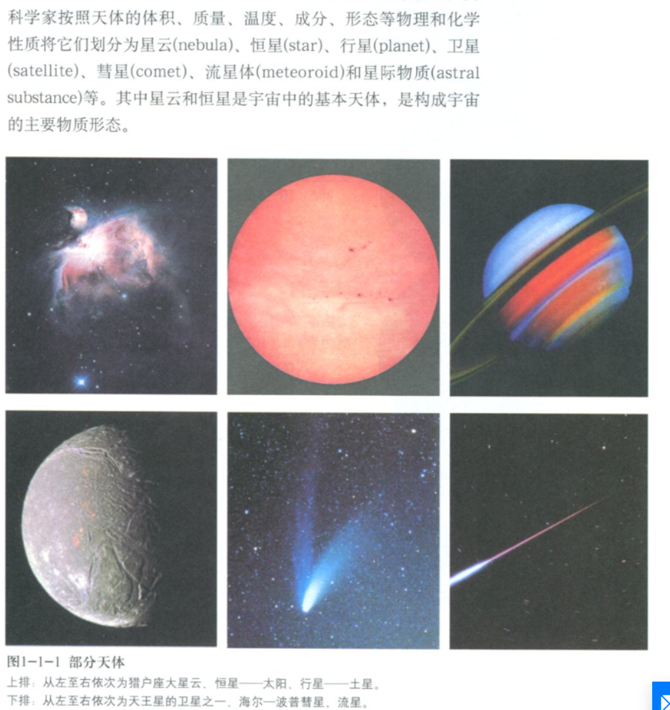
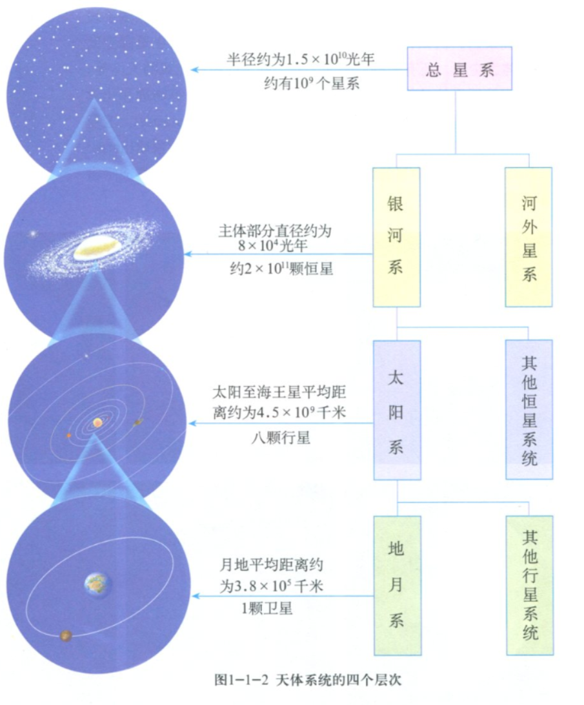
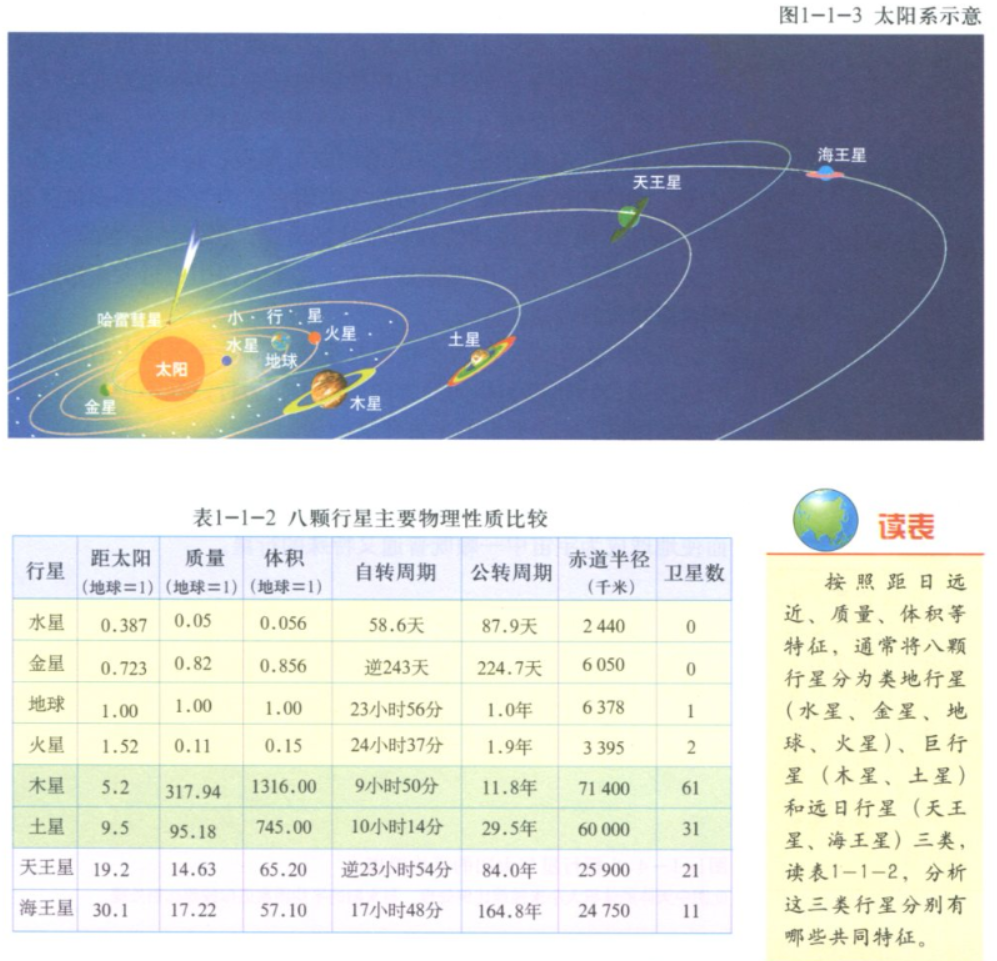
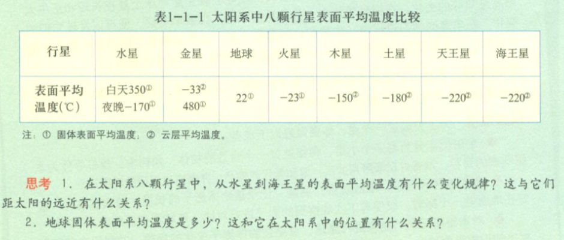

# 地球在宇宙中
## 天体的不同形态
- 天文望远镜中太阳系之外的恒星系统是一个点，但有的点放大之后是一片的形状。这些片状的点不仅仅是恒星系统，而是由多个恒星系统组成的星系

## 天体系统的四个层级

## 太阳系
- 8颗行星
    - 水星 mercury 岩石星球
    - 金星 venus 岩石星球
    - 地球 earth 岩石星球
    - 火星 mars 岩石星球
    - 木星 jupiter 气体星球 （木卫2是岩石星球）
    - 土星 saturn 气体星球
    - 天王星 uranus 气体星球
    - 海王星 neptune 气体星球
- 矮行星
    - 冥王星等
- 小天体
    - 小行星
    - 彗星
    - 流星体
- 行星际物质

# 太阳对地球的影响
## 太阳
- 巨大炙热的气体（等离子）球
- 太阳辐射 solar radiation
    - 电磁波的形式
    - 只有22亿分之一到达地球
- 太阳活动
    - 强弱变化周期为11年
    - 太阳黑子（sunspot）越多越大，太阳活动越强
## 对地球的影响
总体来说还在研究中，有很多假说
- 对气候的影响
    - 年轮的疏密
    - 黑子活动高峰年，反常气候越多
        - 有的地方高峰年干旱， 有的地方高峰年洪涝   
- 对地球电离层 ionosphere的影响
    - 影响无线电通信
- 对地球磁场的影响
    - 极光现象

# 地球的运动

